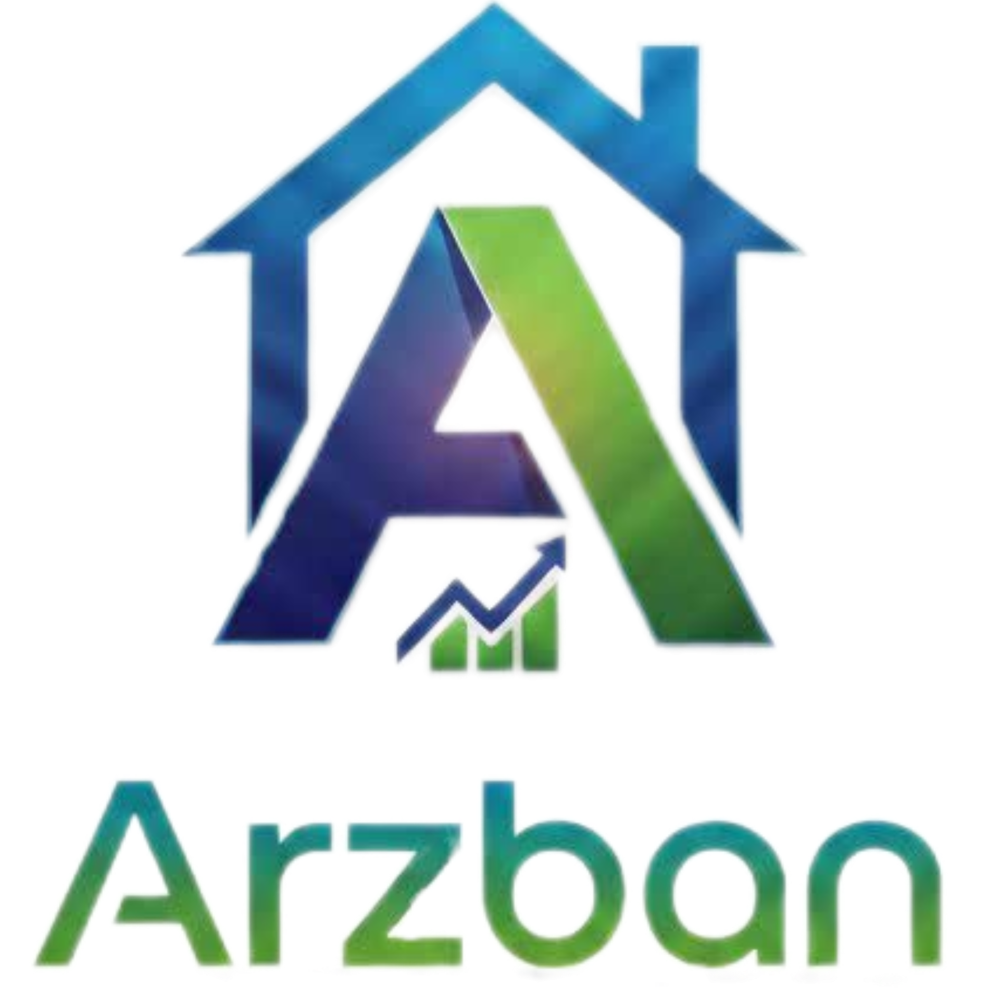
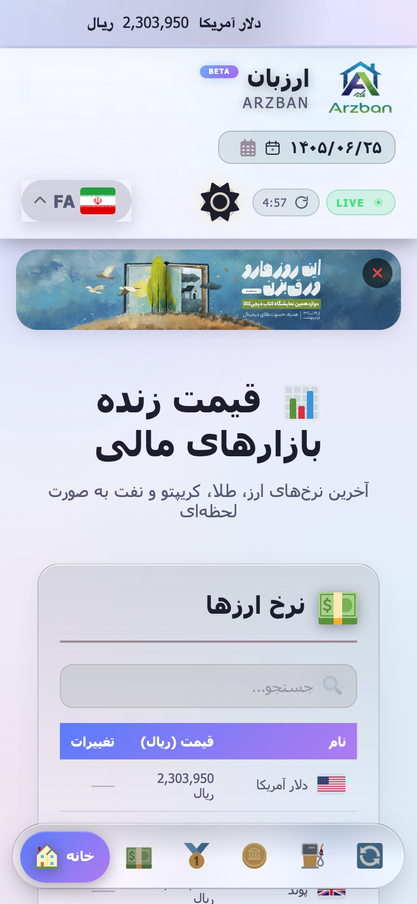
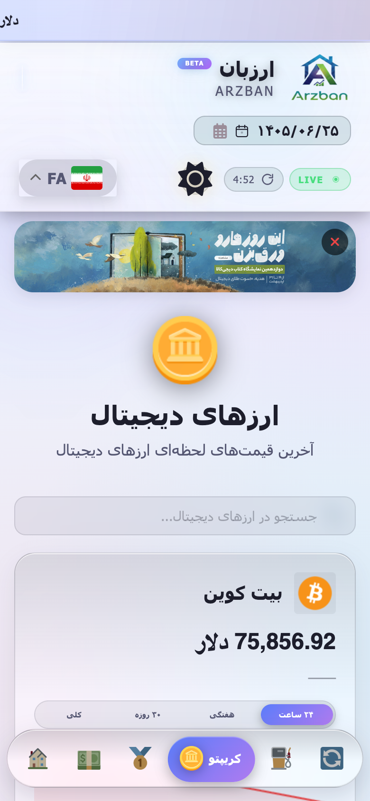
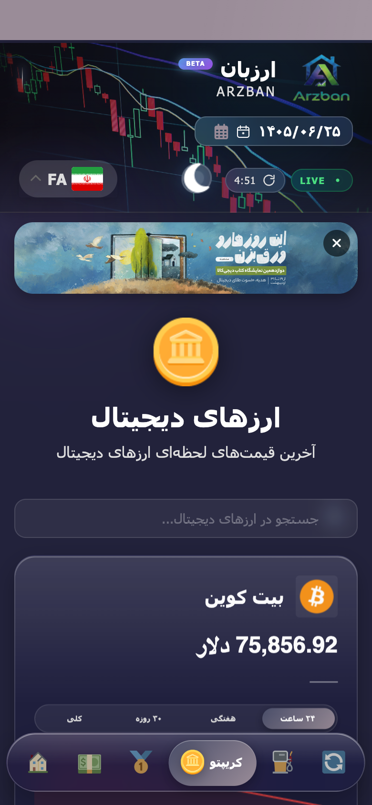

<div align="center">



# ارزبان · ARZBAN

**A real-time Persian (RTL) market-price tracker for currencies, gold, crypto and oil.**

Django scrapes live prices from [TGJU](https://www.tgju.org); a dependency-free vanilla-JS
single-page frontend renders them as a mobile-first, bilingual, dark/light PWA.

<br>


</div>

---

## Table of contents

- [What it does](#what-it-does)
- [Screenshots](#screenshots)
- [Features](#features)
- [Tech stack](#tech-stack)
- [Architecture](#architecture)
- [API reference](#api-reference)
- [Technical decisions](#technical-decisions)
- [Getting started](#getting-started)
- [Configuration](#configuration)
- [Project structure](#project-structure)
- [Testing & verification](#testing--verification)
- [Limitations](#limitations)
- [Credits](#credits)

---

## What it does

ARZBAN tracks **27 financial instruments** across four markets and presents them in a
Persian, right-to-left interface designed for phones:

| Market | Count | Examples |
|---|---:|---|
| 💵 Currency (`currency`) | 11 | USD, EUR, GBP, CAD, TRY, AED, CNY, CHF, INR, IQD, SAR |
| 🥇 Gold & coins (`gold`) | 7 | Gold ounce, 18k/24k gram gold, Emami coin, Bahar Azadi, half & quarter coin |
| ₿ Crypto (`crypto`) | 5 | Bitcoin, Ethereum, Tether, Tron, Ripple |
| 🛢️ Oil (`oil`) | 4 | OPEC basket, Brent, Crude, Arab Light |

Prices are scraped from public TGJU profile pages, cached in SQLite, and served to the
browser as JSON. Historical series for the sparkline charts come from TGJU's public
TradingView-compatible `tvdata` endpoint.

---

## Screenshots

<div align="center">

| Home · light | Crypto · light | Crypto · dark |
|:---:|:---:|:---:|
|  |  |  |

<sub>Captured at 390 × 844 (iPhone-class viewport). The UI is designed mobile-first.</sub>

</div>

---

## Features

**Live data**
- Background scraping of 27 symbols with a 5-minute cache TTL — page loads never block on the network
- Animated price ticker across the top of every page
- Percentage-change badges computed against the previous fetch cycle
- Client-side 5-minute countdown with a manual refresh button
- A first-run overlay that polls real scraper progress (`n / total` + current symbol)

**Charts**
- Canvas sparklines drawn from scratch — no charting library
- Four period tabs per symbol: **24h · 7d · 30d · all**
- Per-period client-side caching, so switching tabs re-renders instantly after first load
- Gain/loss badge derived from the first and last point of the visible window

**Currency converter**
- Any of the 27 symbols → any other
- Rial-normalised: USD-denominated markets (crypto, oil) are converted through the live USD rate
- Server-side validation with Persian error messages

**Interface**
- Full RTL Persian layout with Jalali (Shamsi) date display
- Light / dark theme with a flash-free inline bootstrap script and `localStorage` persistence
- Client-side routing across 6 pages — no full page reloads
- Per-category live search filter
- Installable PWA (`manifest.json`, maskable icons, standalone display)
- GTranslate widget for on-the-fly translation
- Toast notifications, scroll-to-top button, dismissible promo banner

---

## Tech stack

| Layer | Choice | Why |
|---|---|---|
| Backend | **Django 4.2 LTS** | Batteries-included ORM, admin, static handling |
| Database | **SQLite** | 27 rows of volatile data; zero-configuration for reviewers |
| Scraping | **requests + BeautifulSoup4** | TGJU exposes values in stable `data-col` attributes |
| Concurrency | **`threading` + `ThreadPoolExecutor`** | 27 blocking HTTP calls run in ~1 pass instead of 27 sequential round-trips |
| API | **Plain `JsonResponse`** | Nine read-mostly endpoints; DRF would add weight without benefit |
| Frontend | **Vanilla JS (ES2017+), no build step** | Ships as static files, no toolchain to install or maintain |
| Charts | **HTML5 `<canvas>`, hand-rolled** | Sparklines only; avoids a ~200 KB charting dependency |
| Styling | **Handwritten CSS, ~2.5k lines** | CSS custom properties drive the entire theme system |

External runtime resources: Google Fonts (Vazirmatn, Poppins), Font Awesome 6 (CDN),
GTranslate widget. Everything else is served locally.

---

## Architecture

```
 Browser (SPA)                Django                       TGJU
┌──────────────────┐   ┌───────────────────────┐   ┌───────────────────┐
│ index.html       │   │ pricess/views.py      │   │ tgju.org/profile/*│
│  ├ script.js     │──▶│  ├ _schedule_fetch()  │──▶│  (HTML scrape)    │
│  │  ├ router     │   │  │   └ background     │   │                   │
│  │  ├ canvas     │   │  │      thread pool   │   │ platform.tgju.org │
│  │  └ converter  │◀──│  ├ api_* endpoints    │   │  /fa/tvdata/      │
│  └ styles.css    │   │  └ api_chart ─────────┼──▶│  (OHLC history)   │
└──────────────────┘   │        │              │   └───────────────────┘
                       │  pricess/utils.py     │
                       │   ├ get_price_from_   │
                       │   │    tgju()         │
                       │   └ get_chart_data()  │
                       │        │              │
                       │  models.Price ──▶ SQLite
                       └───────────────────────┘
```

**Request flow.** Every price endpoint calls `_schedule_fetch()`, which returns immediately.
If the cached data is older than `_CACHE_TTL` (300 s) and no fetch is already running, it
spawns a daemon thread that scrapes all 27 symbols through a 10-worker pool and writes them
via `update_or_create`. The response is served from SQLite regardless — **a cold or slow
TGJU never blocks a page load.**

**Progress reporting.** The worker thread updates a module-level `_fetch_status` dict
(`running`, `progress`, `total`, `current_item`, `done`). The frontend polls
`/api/fetch-status/` and drives the first-run overlay from it, so users see real progress
rather than an indeterminate spinner.

**Change tracking.** Before each scrape cycle, current DB values are snapshotted into
`_previous_values`. `_compute_change()` diffs the new value against that snapshot to produce
the ▲/▼ percentage badges — no time-series table required.

**Frontend routing.** `loadPage(pageId)` swaps the content container and re-binds handlers.
Nav state lives on `.modern-menu-item[data-page]`. There is no history API integration:
the app is a single URL by design.

---

## API reference

`/` renders HTML; the nine `/api/` endpoints are `GET`-only and return
`{"status": "success"|"error", "data": …}`. List endpoints send
`Cache-Control: no-cache, no-store, must-revalidate`.

| Endpoint | Description |
|---|---|
| `GET /` | Renders the SPA shell with server-side `home_items` |
| `GET /api/currency/` | All currency prices |
| `GET /api/gold/` | All gold & coin prices |
| `GET /api/crypto/` | All crypto prices |
| `GET /api/oil/` | All oil prices |
| `GET /api/all-prices/` | Every tracked symbol |
| `GET /api/home-items/` | The 6 featured symbols shown on the home page |
| `GET /api/fetch-status/` | Live scraper progress for the loading overlay |
| `GET /api/convert/` | `?from=&to=&amount=` → converted value |
| `GET /api/chart/<symbol_name>/` | `?period=24h\|7d\|30d\|all` → price/date series |

**Price object**

```json
{
  "name": "دلار آمریکا",
  "value": "2,303,950",
  "numeric_value": 2303950.0,
  "category": "currency",
  "change": 0.41
}
```

`change` is `null` until a second fetch cycle has completed. `/api/home-items/` adds
`icon` and `color`. Errors use HTTP `400` (bad input) or `404` (unknown symbol) with a
Persian `message`.

---

## Technical decisions

<details>
<summary><b>Chart periods are sliced server-side, not requested from TGJU</b></summary>

<br>

TGJU's `tvdata/history` endpoint accepts `resolution`, `from` and `to` parameters but
**ignores them** — it always returns the complete daily series (~4,200 points). Passing the
period through verbatim would have made all four tabs render identical data.

`_slice_by_period()` in `utils.py` therefore trims the series server-side, measured backwards
from its last timestamp, and guarantees a minimum of two points so the line and the
percentage badge still render when a window lands on a weekend or holiday. The `period`
argument defaults to `'all'`, so any caller that omits it gets the original behaviour byte
for byte.
</details>

<details>
<summary><b>Scraping runs in a background thread, not a cron job or Celery</b></summary>

<br>

A broker plus a worker process would triple the operational surface of a project whose entire
job is refreshing 27 numbers every five minutes. A daemon thread guarded by a lock and a
timestamp gives the same freshness guarantee with zero infrastructure — at the cost of being
per-process (see [Limitations](#limitations)).
</details>

<details>
<summary><b>Prices are stored as strings, not decimals</b></summary>

<br>

TGJU serves pre-formatted, locale-grouped strings (`"2,303,950"`). Storing them verbatim
keeps display exact and avoids re-formatting on every render; `_parse_numeric()` produces the
float whenever arithmetic is needed (change %, conversion), and both representations are sent
to the client as `value` and `numeric_value`.
</details>

<details>
<summary><b>No frontend framework and no build step</b></summary>

<br>

The UI is six pages of tables, a converter and canvas sparklines. Vanilla JS keeps the repo
clone-and-run — no `node_modules`, no bundler, no lockfile drift — and Django serves
`script.js` and `styles.css` as ordinary static files.
</details>

<details>
<summary><b>The USD rate is the conversion pivot</b></summary>

<br>

Currency and gold prices arrive in Iranian Rial; crypto and oil arrive in USD. `api_convert`
normalises both sides to Rial, lazily looking up the live USD rate only when a
USD-denominated symbol is actually involved, then divides. One pivot keeps 27 × 27 possible
pairs correct without a rate matrix.
</details>

<details>
<summary><b>Header glows are clipped on the horizontal axis only</b></summary>

<br>

The header's animated aurora pseudo-elements are wider than the viewport and drift on a
translate animation, which produced ~85 px of horizontal page scroll on phones.
`overflow: hidden` would have fixed it but also clipped the language dropdown, which opens
downward past the header. `overflow-x: clip` removes the sideways scroll while leaving
vertical overflow visible.
</details>

---

## Getting started

### Prerequisites

- Python **3.9+**
- An internet connection (prices are scraped live from TGJU)

### Installation

```bash
git clone <your-repo-url>
cd <repo>/rsstudio

python3 -m venv venv
source venv/bin/activate          # Windows: venv\Scripts\activate

pip install -r requirements.txt
python manage.py migrate
```

### Run

```bash
python manage.py runserver
```

Open **<http://127.0.0.1:8000>**. The first load shows a progress overlay while the scraper
populates the database; subsequent loads are instant and refresh in the background every
five minutes.

> **Tip:** open your browser's device toolbar and pick a phone viewport — the layout is
> mobile-first, and that is how it is meant to be seen.

To view it from a phone on the same network:

```bash
DJANGO_ALLOWED_HOSTS="localhost,127.0.0.1,192.168.1.42" \
  python manage.py runserver 0.0.0.0:8000
```

---

## Configuration

All settings are read from environment variables with development-friendly defaults, so the
project runs with no configuration at all. Override them for anything beyond local use:

| Variable | Default | Purpose |
|---|---|---|
| `DJANGO_SECRET_KEY` | insecure dev key | **Set this for any deployment.** |
| `DJANGO_DEBUG` | `True` | Set to `False` in production. |
| `DJANGO_ALLOWED_HOSTS` | `localhost,127.0.0.1` | Comma-separated hostnames/IPs. |

Application-level tuning lives in code:

| Constant | File | Default | Meaning |
|---|---|---:|---|
| `_CACHE_TTL` | `pricess/views.py` | `300` | Seconds before prices are re-scraped |
| `max_workers` | `pricess/views.py` | `10` | Concurrent scraper threads |
| `_CHART_PERIOD_DAYS` | `pricess/utils.py` | — | Chart window lengths |
| `PRICES_TO_FETCH` | `pricess/views.py` | 27 entries | Tracked symbols and their TGJU URLs |
| `_CHART_API_SYMBOL` | `pricess/utils.py` | 27 entries | Persian name → TGJU chart symbol |

Adding a symbol means appending an entry to `PRICES_TO_FETCH` and a matching entry to
`_CHART_API_SYMBOL`.

---

## Project structure

```
.
├── README.md
├── .gitignore
├── docs/
│   └── screenshots/              # Images used in this README
└── rsstudio/
    ├── manage.py
    ├── requirements.txt
    ├── rsstudio/                 # Project package
    │   ├── settings.py           # Env-driven configuration
    │   ├── urls.py
    │   ├── asgi.py
    │   └── wsgi.py
    └── pricess/                  # The single application
        ├── models.py             # Price (name, value, category, updated_at)
        ├── views.py              # Symbol catalogue, scraper orchestration, 9 endpoints
        ├── utils.py              # TGJU scraping + chart fetching/slicing
        ├── urls.py
        ├── migrations/
        ├── templates/pricess/
        │   └── index.html        # SPA shell (266 lines)
        └── static/pricess/
            ├── script.js         # Router, rendering, charts, converter (1,093 lines)
            ├── styles.css        # Theme system and layout (2,540 lines)
            ├── manifest.json     # PWA manifest
            ├── images/           # Logo, flags, coin art, nav icons, banner
            └── icons/solid/      # Local SVG icon set
```

> `settings.py` overrides `STATICFILES_DIRS` and `TEMPLATES[0]['DIRS']` at the bottom of the
> file to point at the app directory — worth knowing before moving files around.

---

## Testing & verification

There is **no automated test suite** — `pricess/tests.py` is Django's empty boilerplate, and
`python manage.py test pricess` reports `Found 0 test(s)`. This is stated plainly rather than
dressed up; it is the most obvious gap in the project.

What *is* verified, via Django's system checks and an end-to-end browser pass:

```bash
python manage.py check          # configuration
python manage.py migrate        # schema
python manage.py test pricess   # currently 0 tests
```

End-to-end verification performed manually with Playwright against a live server:

- All 9 endpoints return `200` with correct row counts per category
- Converter arithmetic plus all three validation error paths (`400` × 2, `404`)
- Charts across 4 categories × 4 periods, the `404` path, and the no-parameter call
- All 11 currency sparklines painted with correct change badges
- Search filter, all 6 nav pages, refresh countdown reset, theme persistence across reload
- Zero same-origin failed requests; zero horizontal overflow at 360/390/414/768/1280 px

---

## Limitations

Honest constraints, not disclaimers:

- **No automated tests.** The single largest gap.
- **Scraping is selector-coupled.** Prices are read from TGJU's
  `span[data-col="info.last_trade.PDrCotVal"]`. A markup change upstream silently yields
  `None`, and the previous value stays in the database.
- **The 24h chart shows two points.** TGJU serves daily closes only and ignores intraday
  resolution requests, so the shortest honest window is yesterday → today.
- **In-process state.** `_fetch_status`, `_previous_values` and `_last_fetch_time` are
  module-level globals. Under a multi-worker WSGI server each process keeps its own copy,
  so progress reporting and change percentages would need Redis or the database to be
  correct in that setup.
- **Development configuration by default.** `DEBUG` defaults to `True` and the database is
  SQLite. `STATIC_ROOT` is not configured, so deploying means setting the environment
  variables above, adding a `STATIC_ROOT` before `collectstatic`, serving static files
  from a real web server, and replacing the dev server with gunicorn/uWSGI.
- **Mobile-first, not responsive-everywhere.** The layout is built for phone viewports;
  desktop works but is not the design target.
- **No authentication.** All endpoints are public reads. `django.contrib.admin` is routed at
  `/admin/` but no models are registered and no superuser ships with the repo.
- **Persian-only UI.** Translation is delegated to the client-side GTranslate widget rather
  than Django's i18n framework.
- **Third-party dependency.** The project is only as available as TGJU's public pages.

---

## Credits

Built by **Amirhossein Rashmani** (frontend) and **Amirmohammad Saedi** (backend).

Price and historical chart data © [TGJU](https://www.tgju.org). This project is an
independent client and is not affiliated with or endorsed by TGJU.
